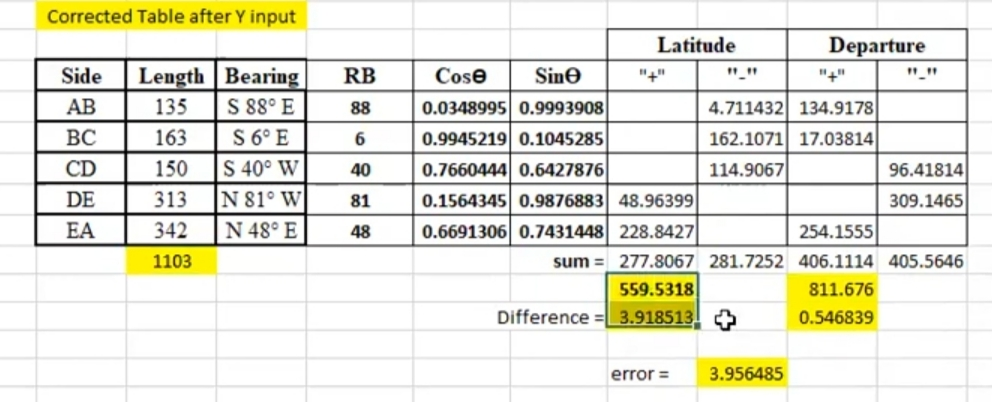

# prismatic-compas

## Erro fixed 100%

Bowditch - বাউডিছ মেথট

transit- ট্রানসিট মেথট

Graphical -- গ্রাফিকেল মেথট

Root( latituda+Depacher) [ পিথাগুরাস উপপাদ্য ]

AB= Erro distance [ answer]

## Bowditch - বাউডিছ মেথট

3.918513*135/1103= 0.47960041251 [ latitude carection of ans]

<!--[profile](./br.jpg)-->

